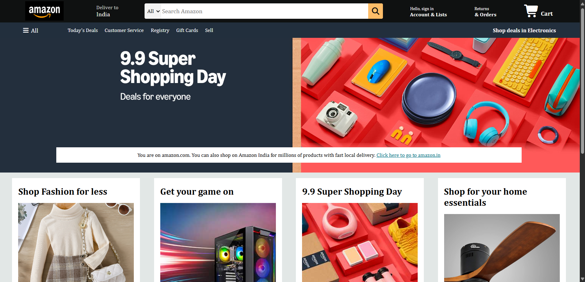
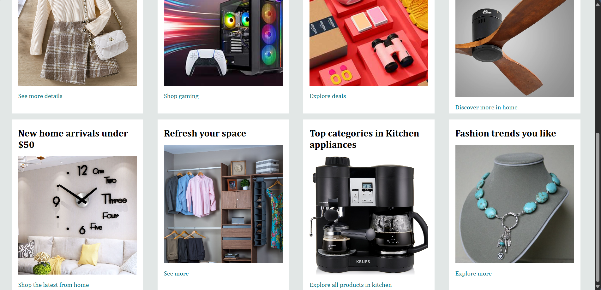

# amazon_clone
Frontend clone of the Amazon homepage [Amazon Global Website] using HTML and CSS. Desktop/Laptop View. Replicated the exact homepage design of the website.

# Author
Anika Varsha Shekar - [@AnikaShekar](https://github.com/AnikaShekar)

# Built with
- HTML
- CSS

# Features
- Responsive Navbar (Navigation bar with logo, delivery location, search Bar, sign-in, returns, and cart.)
- Secondary menu bar (Today’s Deals, Customer Service, Registry, Gift Cards, Sell).
- Hero Section (Full-width hero banner with promotional message and background image.)
- Shopping Sections (Fashion, Gaming, Home Essentials, Kitchen, Trends, etc.)
- Hover Effects (Navbar and search bar elements highlight on hover.)
- Font Awesome Icons (Location pin, cart, menu, and search icons)
- Amazon-like Layout (Clean and simple clone of Amazon’s homepage structure.)

# Screenshots

# Project Structure
├── index.html
├── style.css
├── images/
│   ├── amazon_logo.png 
│   ├── hero_image.jpg
│   ├── img1.jpg
│   ├── img2.jpg
│   ├── img3.jpg
│   ├── img4.jpg
│   ├── img5.jpg
│   ├── img6.jpg
│   ├── img7.jpg
│   ├── img8.jpg
└── README.md